ant-dasbboad is an application that helps user set up their ant nodes and enable moves such as withdrawing mining reward, file upload and download, or stamp management. There are two versions of the online and npm installation package for users to choose, with no difference in functionality.  

:::info
Link to the online dashboard: [http://dashboard.ethsana.org/](http://dashboard.ethsana.org/)  
Link to the npm package: [https://www.npmjs.com/package/ant-dashboard](https://www.npmjs.com/package/ant-dashboard)
:::

## Status page
At the status page, you can view node information, miner reward, Ethereum address and chequebook contract address. You can also withdraw node reward and staked SANA, and proceed configuration NodeApi, DebugNodeApi, etc.  

### Node info  
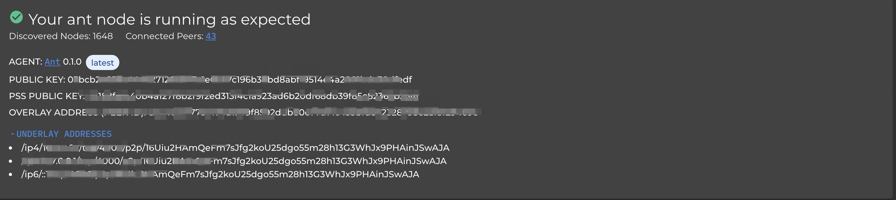  

* public key: public key of the node  
* pss public key: private key of the node  
* overlay address: node address  
* underlay address: p2p address  

### Miner module  
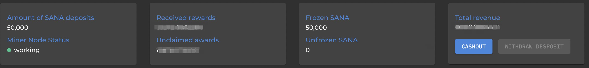 

* amount of SANA deposits  
* miner node status  
    unwork: it means mining not activated  
    working: it means mining ongoing  
    the node is wrong refresh to check: the node may be offline. Click 'refresh checks' button to check operation of the node  
* received rewards  
* unclaimed rewards  
* frozen sana  
    Amount of SANA staked/frozen for mining. The freezing period lasts for 7 days (from the beginning of SANA-staked-for-mining)  
* unfrozen SANA   
    The amount of SANA unfrozen from mining. The frozen and unfrozen amount is of a united batch, which can be withdrawn through the withdraw deposit button.  
    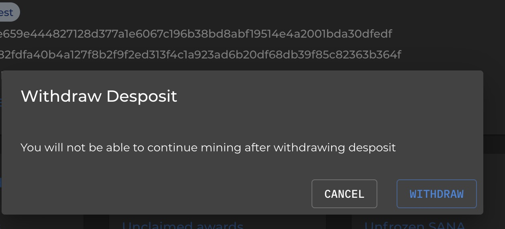 

:::info
Mining should not continue after withdrawing the staked SANA token. Going back to SANA mining requires node restart and SANA re-stake.  
:::
   
* total revenue  
    Total miner income: the sum of the received and unreceived SANA.  

### Address info  
 
* Ethereum address  
* Chequebook contract address  
* The two icons are QR code of the address and the copy button.  

### Node Setup  

Node Setup is used to guide users to configure apiHost and debugApiHost step by step. When the node runs properly, and apiHost and debugApiHost are correctly configured (For nodes running with the remote service, it is necessary to ensure that the device that runs on the node can be accessed through the public network), the 'tip' sign shows 'green' on the left hand side meaning proper proceeding.  
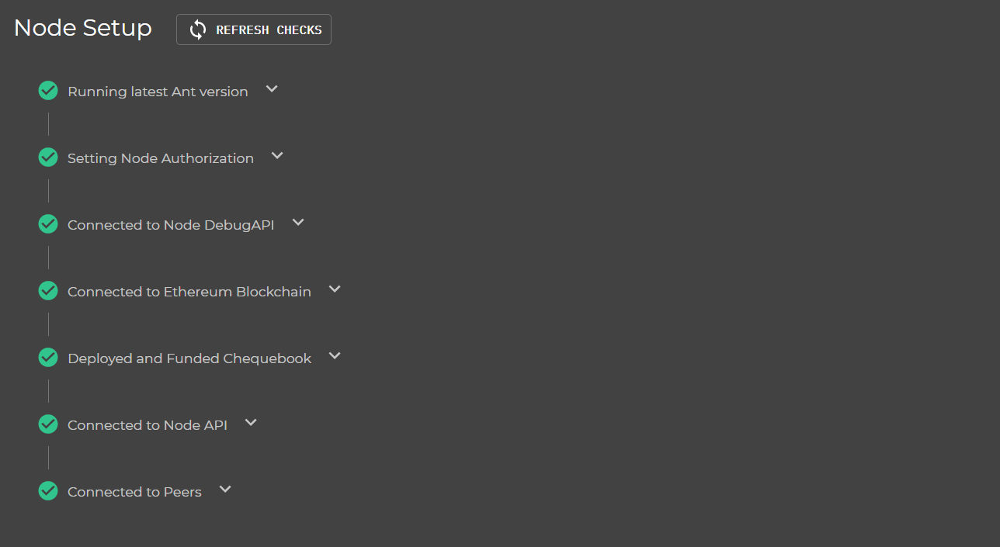 

* Connected to node debugAPI  
    Click on the 'change host' button to change the link address of the debugAPI HOST as pic below.
    When the node runs locally, setting up the http:127.0.0.1:port or http://localhost:port.
    'port' is the debugApi port you configured when starting the node.
    Remote node replaces 127.0.0.1/localhost with your remote service address. Remember to make sure your remote node configuration has displayed the port number and only then it can be accessible.  
 

* Running latest ant version  
    The ant version information being used. 'user version' indicates the ant version you are using, and latest version indicates the latest official release.  
 

* 'Connected to Ethereum Blockchain' and 'Deployed and Funded chequebook' are the Ethereum wallet address and the contract address of the chequebook. Both addresses can only be viewable at proper node running.  
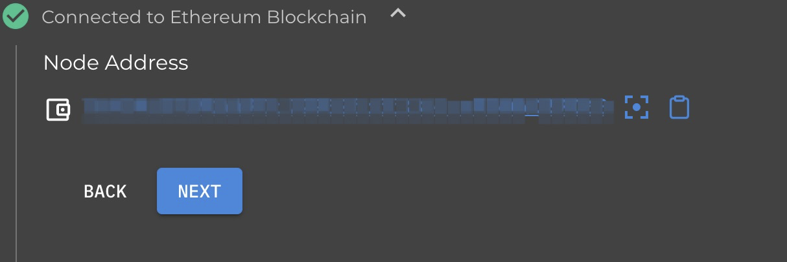  

In the chequebook section, you can withdraw SANA in your own checkbook.  
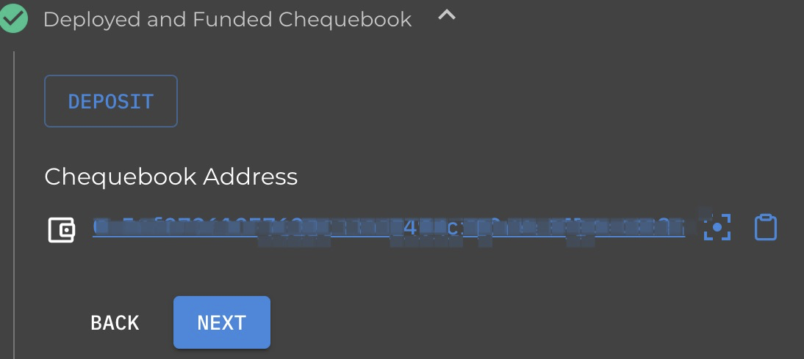 

* 'Connected to Node API' and 'debugNode API' are the HOST used to set up the linked node API.  
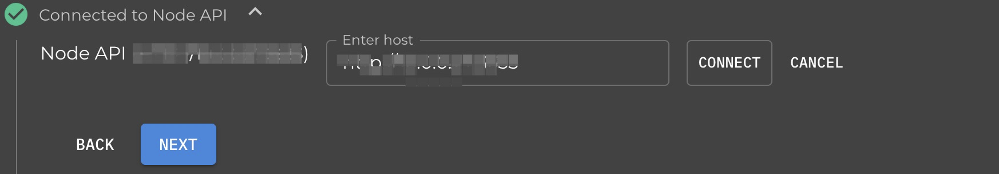 

* Connected to Peers is information display on the amount of peer nodes and the amount of nodes discovered for the current node.  
    a. connected peers: the amount of peer nodes connected  
    b. discovered nodes: the amount of peer nodes discovered for the current host node  
  

If you open the dashboard for the first time, just follow the Node Set-up tutorial step by step to complete the remote service or local node settings for facilitation of node management.

## Files page
The file page is an entry to file upload and download at the SANA network.

* File upload  
You need to buy the 'stamp' as payment for making transactions before uploading a file. Click 'buy postage stamp' for stamp purchase.

After filling in depth(suggestion: 25), amount(suggestion: over 100) and label(optional), click "create" to start the purchase. The specific steps are shown in the pic below.  
  
  

Indication of successful stamp purchase  
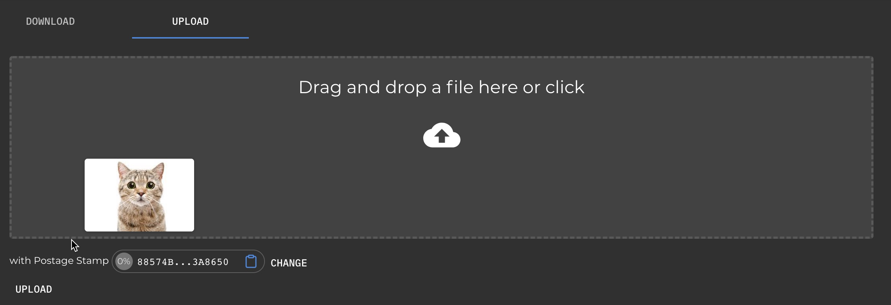  
Indication of starting of file upload

Click 'upload' to upload the file. Successful upload will get you a corresponding hash value of the file. You can copy the hash to the 'download' for retrieving the corresponding file.

  

Indication of a successful uploada

  

Indication of file retrieving at the 'download'
  

Indication of the retrieving result

## Stamps
'stamps' is your stamp management page where you can view information about stamp purchase and consumption.
 
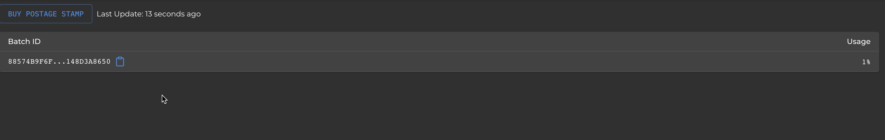 
Indication of the stamp list


## Accounting
The accounting page helps you manage SANA asset, peer balance cheque, withdrawal of any unredeemed checks, and even cash out your reward from other peers.  
  

Indication of the accounting user interface

## Peers  
The peers page is to display the peer node information. Click the 'small rocket button' on the top right to test whether other nodes can be linked to along with corresponding information.  
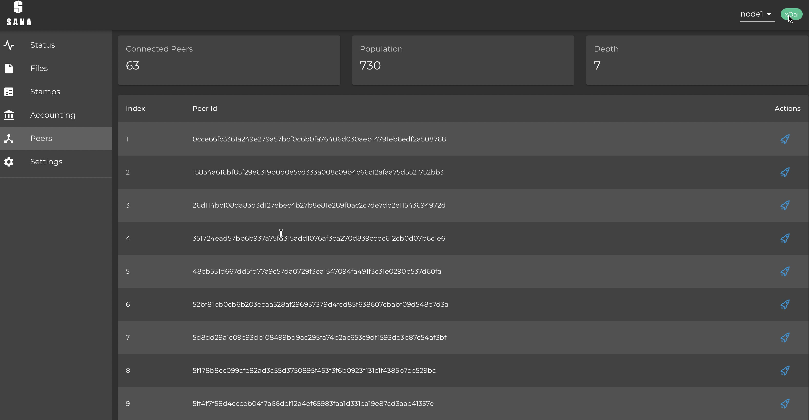  

## Setting
The Setting page has 'connect node api' and 'manage node api'

### connect node api
Set up the apihost and debugApihost of the node.  
  

1. node name

2. Authorization  
To protect the node security, you can activate security protection at the ant0.1.1 or configure 'dashboard-authorization: code' in '.sana.yaml'. 'dashboard-authorization' is an optional field which means normal operation is available without configuration, yet there sees absent of a protective layer.  
Configuration example:  
//xxxxx 'represents any valid string'   
dashboard-authorization: "xxxxx"  
With node authorization protection on, you have to fill in the 'authorization' field to link to the node via the dashboard.  
Value for input is the value configured at the 'dashboard-authoriszation'. The node cannot be accessed without filling or wrong filling of such field. No requirement of value input for linking to nodes that have not opened authorized protection.

3. api endpoint  
Node apihost address is http://localhost:1633 by default. For local nodes you can set 'localhost:port' or '127.0.0.1: portport'. 'port' is the port number that your node runs on, depending on the individual node configuration. Nodes at remote operation needs to ensure that the node's services are accessible via the public network IP address.  

4. debugApiHost  
The debugHost address of the node. Set-up is same as it of Step 2.  

5. Click the update or set button to update the apHost and debugApiHosts of the current node.  

6. Click on the add button to enter the new local node.

### manage node api  
Batch management of node data supports modification, deletion, switching and bulk import of nodes (only batch import of json files supported for the time being)  
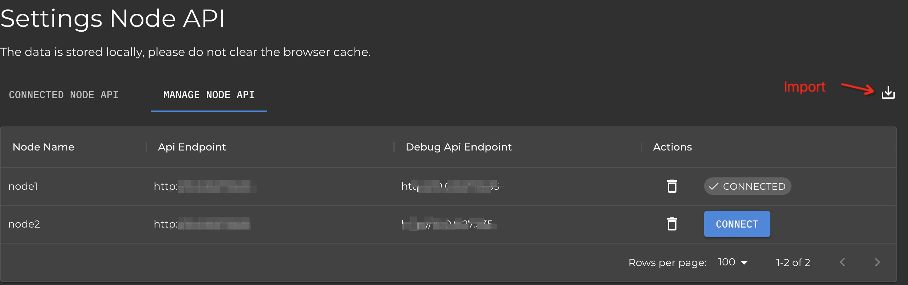  

The json file format for bulk node import node is as follows:  

```json
{
    [ 
        "nodeName": "Not required", 
        "authorizationCode": "Not required", 
        "apiHost": "http://xxxx:xxx", 
        "debugApiHost": "http://xxxx:xxx" 
    ]， 
    ... 
}
```

The navigation bar at the top of the dashboard has the 'entry' to the quick node switching as shown in the pic below  
  