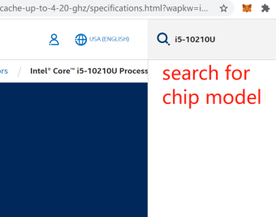
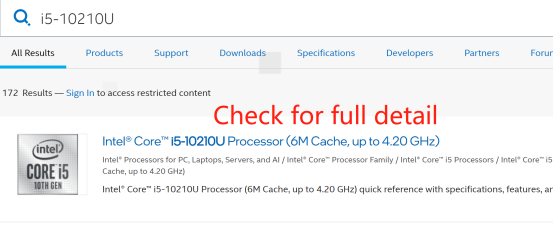
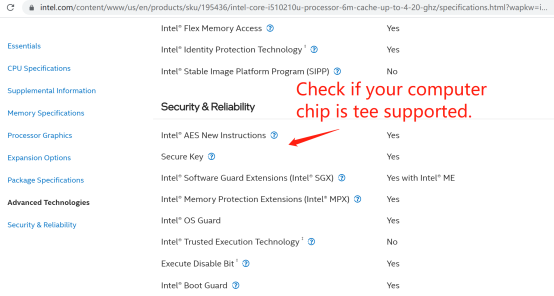
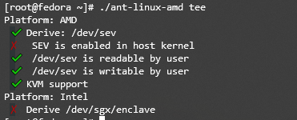
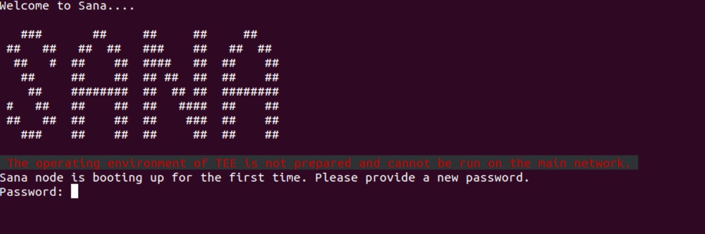
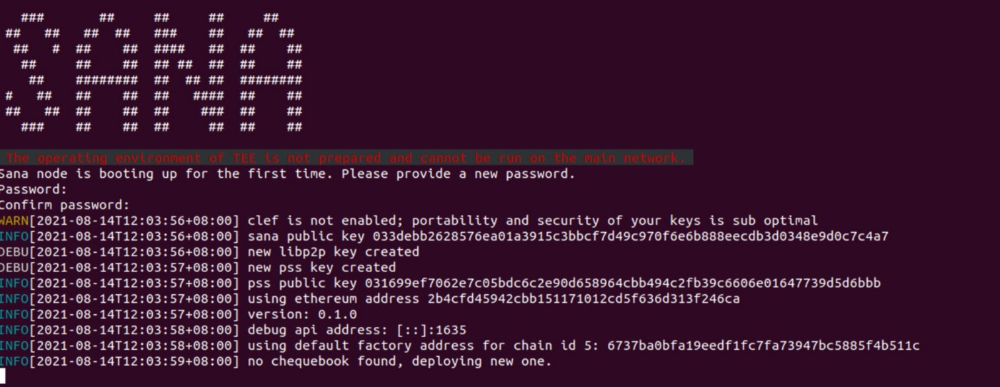

## Step One
Turn on tee (Devices that do not support tee can start directly from the second step)

### AMD
Check host SEV support  

At libvirt> = 6.5.0, you can use the virt-host-validate command to see whether the host supports SEV, or manually check for SEV support through the following steps:

```grep-w sev /proc/cpuinfo``` sees if the host supports the sev properties  

Modify grub to ensure that ```mem_encrypt=on kvm_amd.sev=1，kvm_amd.sev=1``` can also be configured via modprobe  

```bash
$ cat /etc/default/grub
…
GRUB_CMDLINE_LINUX=”… mem_encrypt=on kvm_amd.sev=1"
$ grub2-mkconfig -o /boot/efi/EFI/<distro>/grub.cfg
cat /etc/modprobe.d/sev.conf
options kvm_amd sev=1
```  

Value 1 meaning SEV feature positive can be checked via  

```bash
cat /sys/module/kvm_amd/parameters/sev 
```  

### Intel

Check out your own chip model

```bash
sudo dmidecode | grep CPU
```  

Version: Intel® Core™ i5–10210UCPU @ 1.60GHz Open Intel’s official website and search for your own chip model(Intel official website)

  
  
  

Such chips as shown are tee-supported.

### Confirm the BIOS settings
First open google and search what the BIOS key is for going into your computer. It may vary between computer brands. Restart the computer, quickly press the key just checked, and enter the BIOS interface.  

- Locate Security(security option), find Secure Boot(security start), and select Disabled(Close)
- Locate Boot(start option), and start UEFI in the Boot Mode (startup mode)
- Locate SGX option, Enabled preferred and choose Software Controlled if not. Select Software Controlled, and enter the following instruction to start the driver after entering the system:

```bash
wget https://github.com/ethsana/sgx-tools/releases/download/0.1/sgx_enable
sudo chmod +x sgx_enable
sudo ./sgx_enable
```

:::tip
How to open the Ubuntu terminal: Right-click on the desktop → Open in Terminal
:::  

### Only Supported by Ubuntu 20.04

ant-linux-amd64 tee to view TEE support status

  

## Step Two
For the environment required to install Linux, enter the following commands

```bash
sudo apt-get update
sudo apt-get install wget
```

  

Ask for the installation during the installation process. Enter ‘y’ and ‘space’, wait patiently for it to perform in turn.

## Step Three
Create a folder for sana

```bash
mkdir sana
cd ./sana
```

## Step Four

SANA installation

- Download ant-linux-amd64

```bash
wget https://github.com/ethsana/sana/releases/download/v0.1.1/ant-linux-amd64
```

- Set the execution permissions for ant-linux-amd64

```bash
chmod +x ./ant-linux-amd64
```

## Step Five
Register the RPC address of the xDai main network  
Execute ant-linux-amd64 start command for node initiation

```bash
./ant-linux-amd64 start --verbosity 5 --full-node --swap-endpoint <rpc link of xdai> --debug-api-enable --cors-allowed-origins "*"
```

:::info
The startup parameters can also be written in the configuration file.
```bash
sudo vi ~/.sana.yaml
```
See the document for specific configuration parameters: [configuration](/docs/working-with-ant/configuration)
:::  

- Set the password after a successful startup
  

- Set the password and confirm the password to get the ethereum address
  

## Step Six
- Transfer 50001 SANA to the Ethereum address acquired at the step five, of which 50000 SANA are used as staking token and 1 SANA is used to activate the checkbook.
- Ensure that there is sufficient xDai token on the Ethereum address for gas payment. Minimum of 1 xDai is recommended.