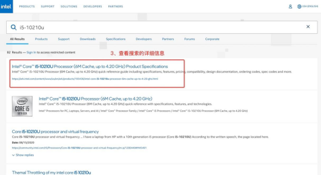
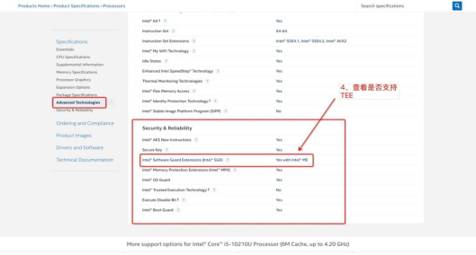
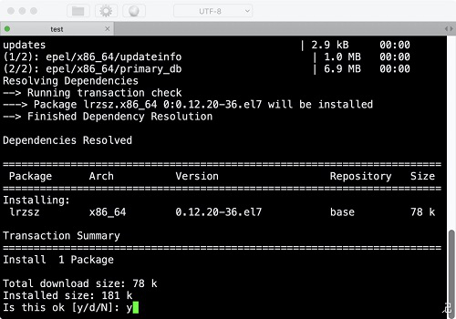
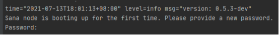
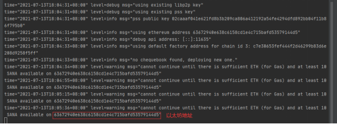

## 第一步：开启TEE
不支持tee的设备可以直接从第二步开始

### Amd

宿主机支持SEV检查在libvirt >= 6.5.0时，可以使用virt-host-validate命令查看宿主机是否支持SEV，或者通过以下步骤来手动检查是否支持SEV：
```bash
grep -w sev /proc/cpuinfo  查看宿主机是否支持sev特性
```
修改grub确保```mem_encrypt=on kvm_amd.sev=1，kvm_amd.sev=1```也可以通过modprobe配置
```bash
$ cat /etc/default/grub
...
GRUB_CMDLINE_LINUX="... mem_encrypt=on kvm_amd.sev=1"
$ grub2-mkconfig -o /boot/efi/EFI/<distro>/grub.cfg
cat /etc/modprobe.d/sev.conf
options kvm_amd sev=1
```
通过```cat /sys/module/kvm_amd/parameters/sev```查看值为1表示SEV特性开启
    
### Inter
查看自己的芯片型号

```bash
sudo dmidecode | grep CPU
-> Version: Intel® Core™ i5-10210UCPU @ 1.60GHz
```

打开英特尔官网，搜索自己的芯片型号（[Intel官网](https://www.intel.com/content/www/us/en/products/overview.html)）
 

 

  

 
如图所示，这样的芯片是支持tee的。

使用搜索引擎，查询进入你的电脑的```BIOS```按键是什么，每个品牌不一样。重启电脑，快速按下刚刚查到的键，进入```BIOS```界面。

1. 找到```Security（安全选项）```，找到```Secure Boot（安全启动）```，选择```Disabled（关闭）```
2. 找到```Boot（启动选项）``` ，在```Boot Mode (启动模式)```里```启动 UEFI```
3. 找到```SGX选项```，优先选```Enabled```，如果没有则选```Software Controlled```。选择```Software Controlled```的，进入系统以后在终端输入下面的指令启动驱动：
```
wget https://github.com/ethsana/sgx-tools/releases/download/0.1/sgx_enable
sudo chmod +x sgx_enable
sudo ./sgx_enable
```
:::tip
如何打开 Ubuntu 终端?  
在桌面点击右键 → ```Open in TerminalUbuntu```
:::

### 操作系统 Ubuntu 20.04

目前暂不支持此版本以外的其他版本或系统
```bash
ant-linux-amd64 tee 查看TEE支持情况
```


## 第二步 安装SANA
1. 安装Linux所需环境，依次输入以下命令：
```bash
sudo apt-get update
sudo apt-get install wget
```
  
安装过程中询问是否安装，输入```y```回车即可，耐心等待，依次执行。  
2. 创建sana工作文件夹
```bash
mkdir sana
cd ./sana
```
3. 下载ant-linux-amd64包，设置包的执行权限
```bash
wget https://github.com//ethsana/sana/releases/download/v0.1.1/ant-linux-amd64
chmod +x ./ant-linux-amd64
```

## 第三步 启动节点
1. 注册xDai主网的RPC
2. 启动节点
```bash
./ant-linux-amd64 start --verbosity 5 --full-node --swap-endpoint <上一步注册的xDai RPC地址> --debug-api-enable --cors-allowed-origins "*"
```
3. 启动成功后设置密码  
   
4. 第二次确认密码，获取钱包地址  
